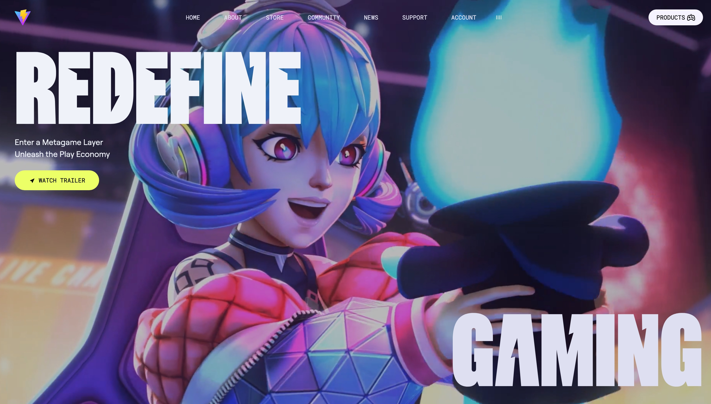

# 🎮 Modern Gaming Website

## 🌟 Preview



## 🔥 Live Demo

Check out the live demo here: [Live Demo](https://modern-gaming-website.vercel.app/)

---

## 🚀 Tech Stack

- **Vite** - Fast build tool
- **Tailwind CSS** - Utility-first CSS framework
- **GSAP** - For smooth animations

## 📁 Installation

```bash
# Clone the repository
git clone https://github.com/Anisubhra/modern-gaming-website.git

# Navigate to the project directory
cd modern-gaming-website

# Install dependencies
npm install

# Start the development server
npm run dev
```

## 📌 Features

- ⚡ **Blazing fast** performance with Vite
- 🎯 **Responsive design** using Tailwind CSS
- 🕹️ **Smooth animations** powered by GSAP
- 🛠️ **Modern UI** inspired by gaming aesthetics

## 📬 Contact

Have questions or suggestions? Feel free to reach out:

- [LinkedIn](https://www.linkedin.com/in/anisubhrasarkar/)
- [GitHub](https://github.com/Anisubhra)
- [Twitter](https://x.com/anisubhrasarkar)

---

⭐ **Drop a star if you liked this project!**